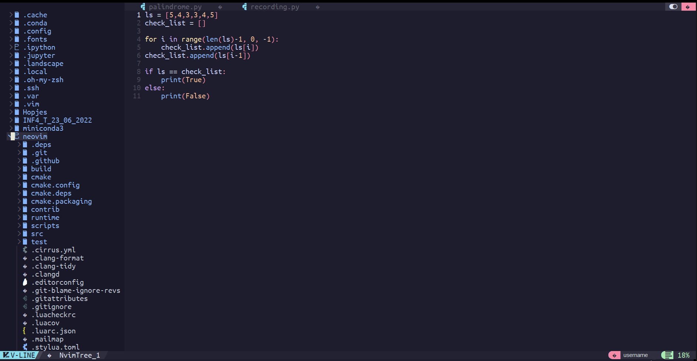

```
# NeovimPersonalSetup
My step plan for configuring neovim and NvChad as working enviroment on ubuntu.
This guide is for installing **locally** and **NOT** for installing it with root access.
The reason why was originally due to remote working as a user.

## For this plan to work are three steps required to follow.
1. Install Nerd or Hack font
- If some symbols don't load correctly, it can be due to the version of the downloaded font. Try downloading a different version or font to solve this problem
2. Install Neovim
3. Install NvChad

## General links where I downloaded all required files
1. https://www.nerdfonts.com/font-downloads
2. https://github.com/NvChad/NvChad
3. https://github.com/neovim
## Link that informed me about the existence of NvChad
- https://www.youtube.com/watch?v=Mtgo-nP_r8Y&ab_channel=DreamsofCode
```


## Step one -- Install a font through command line
Using wget the zip containing fonts can be obtained.
1. Go to the website nerdfonts[https://www.nerdfonts.com/font-downloads] and search a font
**Linux**
2. Right-click the download button of your desired font and click copy linkadress
3. wget link; e.g.:
  - wget https://github.com/ryanoasis/nerd-fonts/releases/download/v3.1.1/Ubuntu.zip
4. Unzip the zip
  - unzip Ubuntu.zip
5. Copy the file(s) to ~/.local/share/fonts; if it doesn't exist make it using mkdir.
  - cp Downloads/*.ttf ~/.local/share/fonts -r
or
  - cp Downloads/name.ttf ~/.local/share/fonts
6. In ~/.config/nvim add a linking line at the bottom of init.lua (or init.vim)
  - Do this either with nano, vim or another file editor service you have.
  - vim ~/.config/nvim/init.lua
7. Jump to end of line
  - shift + g 
8. Press O to insert new line and paste the line
  (Notice that you only have to type in the font name and no extension)
  (Keep :h10 next to the name for font size)
  In init.lua:
  - vim.o.guifont = "UbuntuMono Nerd Font:h10"
  In init.vim
  - set guifont=YourNerdFont:h10
9. Write and quit the file e.g. in vim
  - :wq (write and quit)
    
**Windows wsl ubuntu with mouse** \
2. Press the download button to download the zip and unzip it. \
3. In the unzipped folder e.g. UbuntuMono select all .ttf files and right-click the selection. \
4. Press install, which then you can select the font you want in the properties tab of the terminal you use under font style.

**Note**
Some versions of fonts or different fonts simply don't support some symbols. If symbols don't load try to find a font that supports
as much symbols possible, so you can accept the setback.

## Step two -- Install Neovim
This can be either done with sudo or locally. But the local install worked for me better in one go.
1. Make an extra directory for each neovim version install, e.g.:
   - mkdir neovim_new
3. From home git clone the neovim repository 
   - git clone https://github.com/neovim/neovim.git
5. Enter directory
   - cd neovim
7. Configure Neovim into the new directory from step 1
   - make CMAKE_BUILD_TYPE=Release CMAKE_INSTALL_PREFIX=$HOME/lib/neovim_new
  - (Note, if you need to have **make** installed. Also if an error occurs saying name package misses, you have to install that also)
  - Chatgpt prompted me these to be important: sudo apt-get install ninja-build gettext libtool libtool-bin autoconf automake cmake g++ pkg-config unzip
  - If you can't use sudo, you have to install and compile these yourself. Try doing this when you don't have anything to do with some music in the background.
4. Build Neovim
  - make
5. Install Neovim
  - make install
6. Update PATH by adding line in zshrc or bashrc
  - export PATH="$HOME/lib/neovim_new/bin:$PATH"
7. Update rc file
  - source ~/.bashrc
or 
  - source ~/.zshrc
 
**Note**
You have cloned the repository of neovim! This means by pulling you will receive newer versions.
One neovim is installed; type: nvim --version, to check to current version.

## Step three -- Install NvChad

1. Delete local neovim cache
  - rm -rf ~/.local/share/nvim
2. Git clone NvChad repository
  - git clone hhtps://github.com/NvChad/NvChad ~/.config/share/nvim --depth 1
3. Open neovim
  - nvim
4. Prompt: Do you want to install example custom config? (y/n): N
  - So type N (no)
    
**5.noProblems.** If no packages are missing the installation will start and once finished search for a video telling what you can do with NvChad.

**5.Problems.** If package are missing, because of course that's fun. You will probably get a lua error. In my installation run I missed gettext.
Below I will give an example of how I installed gettext, this method you can apply for any package you are missing. \
5.1. Go to https://ftp.gnu.org/gnu/gettext/?C=M;O=D for all gettext archives. \
5.2. Click on Last Modified to sort to the latest year (e.g. 2023). \
5.3. Look for a file extensions like this: 	gettext-0.22.4.tar.gz. \
5.4. Right-click the link name and copy the linkadress. \
5.5. Use wget to download the linkadress from command line \
    - wget https://ftp.gnu.org/gnu/gettext/gettext-0.22.4.tar.gz \
5.6. Extract source code
   - tar -xzvf gettext-0.22.4.tar.gz \
  
5.7. Enter directory
   - cd gettext-0.22.4 \
    
5.8. Configure and compile Gettext
   - ./configure --prefix=$HOME/gettext
   - make
   - make install \
   
5.9. Update PATH and other environment variables by adding export lines to you zshrc or bashrc
   - export PATH="$HOME/gettext/bin:$PATH"
   - export LD_LIBRARY_PATH="$HOME/gettext/lib:$LD_LIBRARY_PATH"
   - export C_INCLUDE_PATH="$HOME/gettext/include:$C_INCLUDE_PATH"
   - export CPLUS_INCLUDE_PATH="$HOME/gettext/include:$CPLUS_INCLUDE_PATH" \
     
6.0. Source zshrc or bashrc and try from 3. Open neovim again until you reach 5.noProblems., so you can start using pretty neovim.
